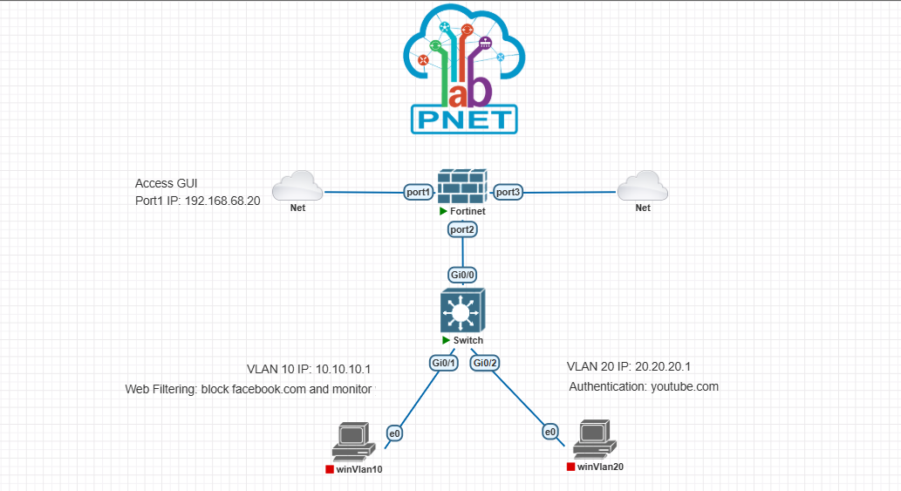

# Project 02 — Basic Security Profiles

> Granular Web Filtering, URL Filtering, Deep SSL/SSH Inspection, and Captive Portal User Authentication across segmented VLANs on FortiOS 7.0.

---

## Objective

Configure 802.1Q VLAN subinterfaces on a single physical link (Router-on-a-Stick) with integrated DHCP services, apply Deep SSL Inspection and URL Filtering profiles to enforce URL blocking and monitoring on VLAN 10, and deploy an identity-based firewall policy on VLAN 20 that triggers captive portal authentication for specific web destinations (YouTube) while allowing transparent access to general internet traffic.

---

## Network Topology



| Device | Role | IP Address | Interface |
|--------|------|------------|-----------|
| **Fortinet** (FortiGate-VM64-KVM) | Out-of-Band Management / Web GUI | 192.168.68.20/24 | `port1` |
| **Fortinet** (FortiGate-VM64-KVM) | 802.1Q Trunk Gateway (VLAN 10) | 10.10.10.1/24 | `port2` -> `VLAN_10` (VLAN ID 10) |
| **Fortinet** (FortiGate-VM64-KVM) | 802.1Q Trunk Gateway (VLAN 20) | 20.20.20.1/24 | `port2` -> `VLAN_20` (VLAN ID 20) |
| **Fortinet** (FortiGate-VM64-KVM) | WAN / Internet Uplink | DHCP Assigned (Upstream Net) | `port3` (alias: `wan`) |
| **Switch** (L2 Switch) | Access & Trunk Switching | Unmanaged / L2 Pass-through | `Gi0/0` (Trunk to FGT `port2`), `Gi0/1` (VLAN 10), `Gi0/2` (VLAN 20) |
| **winVlan10** | LAN Client (VLAN 10) | 10.10.10.2/24 (DHCP) | `e0` (connected to Switch `Gi0/1`) |
| **winVlan20** | LAN Client (VLAN 20) | 20.20.20.2/24 (DHCP) | `e0` (connected to Switch `Gi0/2`) |

---

## Environment

| Item | Details |
|------|---------|
| Platform | PNetLab |
| FortiOS Version | 7.0.3 (build 0237) |
| FortiGate Model | FortiGate-VM64-KVM |
| Date | 2026-09-13 |

---

## Key Concepts

- **802.1Q Subinterfaces (Router-on-a-Stick):** Multiplexing multiple logical broadcast domains over a single physical link (`port2`) using 802.1Q encapsulation tags (VLAN ID 10 and VLAN ID 20).
- **Custom URL Filtering:** Enforcing exact and wildcard URL rules within a Web Filter profile to override or supplement FortiGuard category classifications.
- **Deep SSL/SSH Inspection (Man-in-the-Middle):** Decrypting, inspecting, and re-encrypting SSL/TLS sessions on port 443 to inspect full HTTP URLs, headers, and payloads beyond basic SNI (Server Name Indication).
- **Identity-Based Firewall Policies (Captive Portal):** Restricting traffic based on user group membership (`local_users`) and redirecting unauthenticated HTTP/HTTPS traffic to the FortiGate authentication portal.
- **Firewall Policy Ordering:** Utilizing FortiOS top-down policy evaluation where specific destination-restricted and authentication-gated policies are evaluated before generic internet policies.
- **Dynamic DHCP WAN & Source NAT (PAT):** Utilizing DHCP client configuration on the WAN interface (`port3`) for automatic default routing, combined with NAT overload for outbound client traffic.

---

## Configuration Summary

> Full configs are in `/configs`. This section explains the *why* behind key decisions.

### 1. VLAN Subinterfaces & Local DHCP Services

Rather than requiring multiple physical cabling runs from the FortiGate to the local switch, `port2` acts as an 802.1Q trunk supporting subinterfaces `VLAN_10` (10.10.10.1/24) and `VLAN_20` (20.20.20.1/24). Dedicated DHCP servers are bound to each logical interface to provide automated IP assignment and set the FortiGate subinterface as the default gateway.

```bash
config system interface
    edit "VLAN_10"
        set vdom "root"
        set ip 10.10.10.1 255.255.255.0
        set allowaccess ping https ssh
        set alias "VLAN_10"
        set role lan
        set interface "port2"
        set vlanid 10
    next
    edit "VLAN_20"
        set vdom "root"
        set ip 20.20.20.1 255.255.255.0
        set allowaccess ping https ssh
        set alias "VLAN_20"
        set role lan
        set interface "port2"
        set vlanid 20
    next
end

config system dhcp server
    edit 2
        set dns-service default
        set default-gateway 10.10.10.1
        set netmask 255.255.255.0
        set interface "VLAN_10"
        config ip-range
            edit 1
                set start-ip 10.10.10.2
                set end-ip 10.10.10.254
            next
        end
    next
    edit 3
        set dns-service default
        set default-gateway 20.20.20.1
        set netmask 255.255.255.0
        set interface "VLAN_20"
        config ip-range
            edit 1
                set start-ip 20.20.20.2
                set end-ip 20.20.20.254
            next
        end
    next
end
```

### 2. URL Filtering & Deep SSL Inspection (`WF_VLAN_10`)

To block `facebook.com` and monitor `yahoo.com`, a custom URL filter table (`urlfilter-table 1`) is applied inside the Web Filter profile `WF_VLAN_10`. Because modern web applications enforce HTTPS, `deep-inspection` is applied to decrypt TLS handshakes and inspect full URL requests and paths.

```bash
config webfilter urlfilter
    edit 1
        set name "Auto-webfilter-urlfilter_rt5hkksbo"
        config entries
            edit 1
                set url "*facebook.com*"
                set type wildcard
                set action block
            next
            edit 2
                set url "*yahoo.com*"
                set type wildcard
                set action monitor
            next
        end
    next
end

config webfilter profile
    edit "WF_VLAN_10"
        config web
            set urlfilter-table 1
        end
        config ftgd-wf
            config filters
                edit 1
                    set category 26   # Malicious Websites
                    set action block
                next
                edit 2
                    set category 61   # Phishing
                    set action block
                next
            end
        end
    next
end
```

### 3. User Authentication & Captive Portal Policy Sequencing

VLAN 20 requires user authentication exclusively when accessing YouTube services (`youtube.com`, `*.youtube.com`), while allowing free access to the rest of the web. This is achieved by creating an address group for YouTube and placing the identity-gated policy ahead of the catch-all policy in the firewall table.

```bash
config user local
    edit "user1"
        set type password
        set passwd ENC ...
    next
end

config user group
    edit "local_users"
        set member "user1"
    next
end

config firewall addrgrp
    edit "youtube"
        set member ".youtube.com" "youtube.com"
    next
end

config firewall policy
    edit 1
        set name "allowVlan10ToAccessWan"
        set srcintf "VLAN_10"
        set dstintf "port3"
        set action accept
        set srcaddr "VLAN_10 address"
        set dstaddr "all"
        set schedule "always"
        set service "ALL"
        set utm-status enable
        set ssl-ssh-profile "deep-inspection"
        set webfilter-profile "WF_VLAN_10"
        set logtraffic all
        set nat enable
    next
    edit 2
        set name "vlan20AuthYoutube"
        set srcintf "VLAN_20"
        set dstintf "port3"
        set action accept
        set srcaddr "VLAN_20 address"
        set dstaddr "youtube"
        set schedule "always"
        set service "ALL"
        set ssl-ssh-profile "deep-inspection"
        set logtraffic all
        set groups "local_users"
        set nat enable
    next
    edit 3
        set name "allowVlan20AccessWan"
        set srcintf "VLAN_20"
        set dstintf "port3"
        set action accept
        set srcaddr "all"
        set dstaddr "all"
        set schedule "always"
        set service "ALL"
        set nat enable
    next
end
```

---

## Testing & Verification

| Test Case | Command / Method | Expected Result | Actual Result | Pass/Fail |
|-----------|-----------------|-----------------|---------------|-----------|
| DHCP Lease Acquisition (VLAN 10) | `ipconfig /renew` or DHCP client on `winVlan10` | Receives IP `10.10.10.x/24`, Gateway `10.10.10.1`, DNS `8.8.8.8` | IP `10.10.10.2` assigned | ✅ |
| DHCP Lease Acquisition (VLAN 20) | `ipconfig /renew` or DHCP client on `winVlan20` | Receives IP `20.20.20.x/24`, Gateway `20.20.20.1`, DNS `8.8.8.8` | IP `20.20.20.2` assigned | ✅ |
| General Internet Connectivity (VLAN 10) | `ping 8.8.8.8` from `winVlan10` | ICMP Echo Replies received via NAT (`port3`) | Reply received (`0% packet loss`) | ✅ |
| Web Filter URL Block (`facebook.com`) | Browser request to `https://www.facebook.com` from `winVlan10` | HTTP 403 / FortiGuard Block replacement page displayed | Block page served by FortiGate | ✅ |
| Web Filter URL Monitor (`yahoo.com`) | Browser request to `https://www.yahoo.com` from `winVlan10` | Page loads successfully; logged under Web Filter logs as monitor event | Page displayed; log entry created | ✅ |
| VLAN 20 General Web Browsing | Browser request to `https://www.google.com` from `winVlan20` | Matches Policy 3 (`allowVlan20AccessWan`); no authentication prompted | Website loads without authentication prompt | ✅ |
| VLAN 20 YouTube Captive Portal Challenge | Browser request to `https://www.youtube.com` from `winVlan20` | Matches Policy 2; redirected to FortiGate captive portal login page | Captive portal displayed requesting login | ✅ |
| VLAN 20 User Authentication | Enter username `user1` and credentials on captive portal | User authenticated successfully; YouTube page loads | User authenticated; session established | ✅ |
| Active User Verification | FortiGate CLI: `diagnose user firewall list` | `user1` listed with active authenticated session and IP `20.20.20.x` | `user1` confirmed active | ✅ |

---

## Lessons Learned

- **Deep Inspection is Mandatory for Precise URL Filtering:** Standard certificate inspection only examines the SNI domain in the TLS client hello. Blocking specific paths, URLs, or embedded resources requires deep SSL inspection with client-side trusted CA deployment.
- **Top-Down Policy Evaluation Dictates Authentication Behavior:** In FortiOS, captive portal authentication is policy-driven. Specific destination-based authentication policies must always precede open outbound policies to prevent unintentional bypass.
- **VLAN Interface Role and Services:** Configuring interface aliases and device identification on subinterfaces simplifies troubleshooting and traffic monitoring across multiple isolated virtual segments.

---

## Files in This Project

| File | Description |
|------|-------------|
| `configs/FortiGate-VM64-KVM_7-0_0237_202609131349.conf` | Full FortiGate configuration export |
| `topology/topology.png` | Network topology diagram |
| `pnet_export/` | PNetLab topology export archive directory |
| `README.md` | Comprehensive lab documentation and implementation guide |

