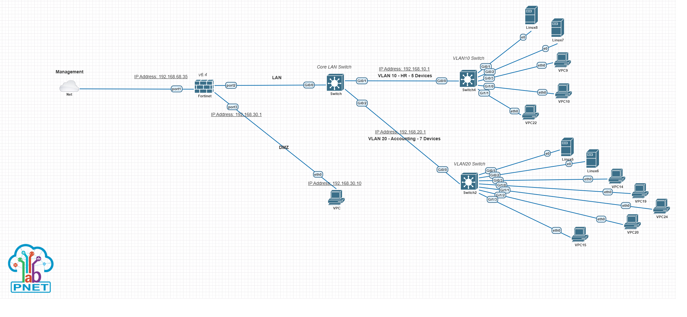

# FortiGate NSE 4 Network Security Lab

A hands-on network security lab built with PNETLab to practice FortiOS.

## Objectives

- Build a realistic enterprise network
- Practice FortiOS and get hands on experience
- Understand how firewalls work
- Troubleshoot network problems
- Prepare for Fortinet NSE 4 certification

## Topology

## Technologies Used

- FortiGate
- Cisco IOS switches
- PNETLab

## Network Design

| Network | Subnet | Purpose |
|---|---|---|
| Management | 192.168.68.0/24 | Management / PNETLab |
| VLAN 10 | 192.168.10.0/24 | HR |
| VLAN 20 | 192.168.20.0/24 | Accounting |
| DMZ | 192.168.30.0/24 | Public-facing services |

## Devices

| Device | Role |
|---|---|
| FortiGate | Firewall / Router |
| Core Switch | Switch between VLANs |
| Access Switch 1 | VLAN 10 |
| Access Switch 2 | VLAN 20 |
| VPCs | Client testing |

## Practiced

### Networking

- [ x ] VLAN configuration
- [ x ] Trunking
- [ x ] Inter-VLAN routing
- [ x ] Static routing
- [ x ] DHCP

### FortiGate

- [ ] Interfaces
- [ ] Firewall policies
- [ ] NAT
- [ ] DNAT / VIP
- [ ] Address objects
- [ ] Service objects
- [ ] Security profiles
- [ ] Logging
- [ ] Authentication
- [ ] RADIUS
- [ ] VPN
- [ ] HA

## Troubleshooting

Document important problems encountered during the lab.

Examples:

- VLAN connectivity problems
- Trunk configuration errors
- FortiGate routing problems
- NAT problems
- VIP/DNAT problems
- PNETLab connectivity problems

## Lessons Learned

Document the networking and security concepts learned during
each lab instead of only documenting the final configuration.

## Progress and Tracking

- 26/9/2026 -> 1/10/2026: Built the network